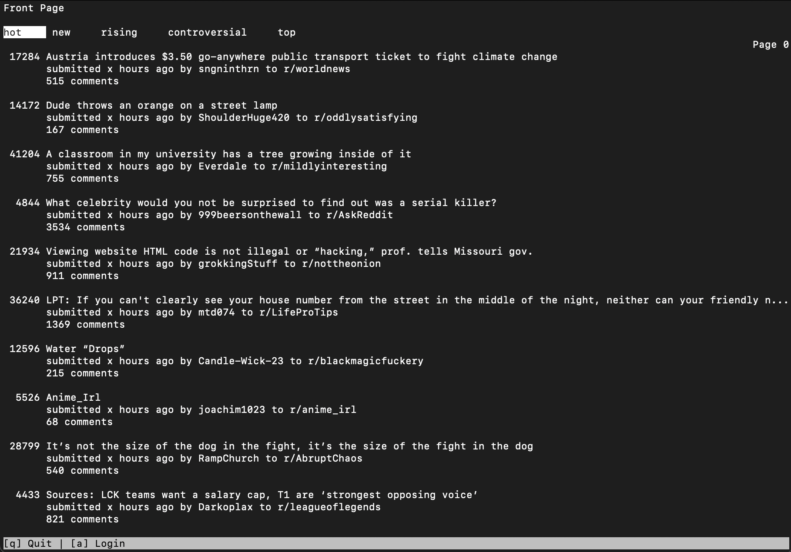

# Tiny Reddit

## About

Tiny Reddit is a reddit application built in the terminal. Not currently updating this project, but feel free to play around.

## Features:

- Browse reddit posts in the terminal!
- Sort posts
- Log in: upvote/downvote posts (currently broken)

## Installation

Install dependencies:

`pip3 install -r requirements.txt`

Run:

`python3 core.py`

## Dependencies

- [urwid](https://github.com/urwid/urwid)
- [praw](https://github.com/praw-dev/praw)

## Keybindings

| Key   | Function         |
| :---- | :--------------- |
| q     | Exit application |
| a     | Login            |
| Enter | Select Post/Sort |
| ⬇⬆➡⬅  | Navigation       |
